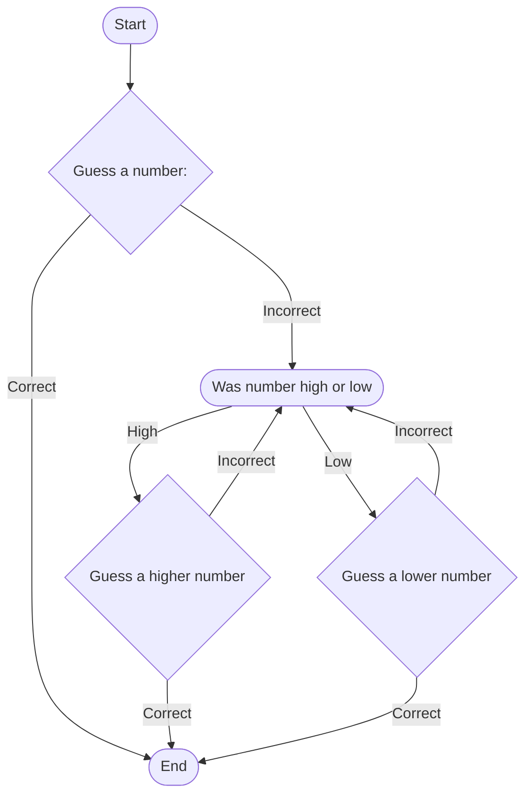

## How the game works
- First the user guesses a number 
- If they get it right first try, the game ends
- If they get it wrong, the program decides whether the number is high or low
- With that information, the user gets the message "Guess a higher number" or "Guess a lower number"
- And the loop continues until the user gets the number correct
